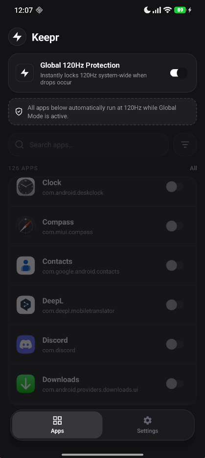
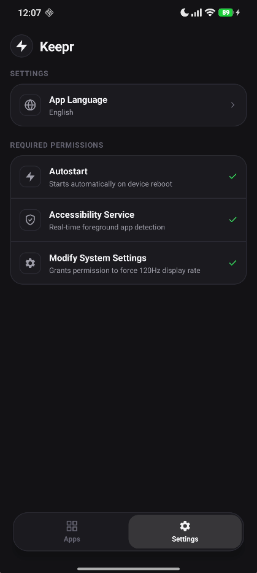

# Keepr ⚡ — Xiaomi (HyperOS / MIUI) 120Hz Refresh Rate Manager

[](https://github.com/SwomSanchez)
[](https://android.com)
[](https://kotlinlang.org)
[](https://github.com)
[](LICENSE)

**Keepr** is a lightweight, zero-battery-drain, and rootless Android application designed for **Xiaomi, Redmi, and POCO devices (HyperOS & MIUI)** to permanently eliminate aggressive 60Hz display throttling.

---

## 🛑 The Problem
On Xiaomi devices with 120Hz displays, MIUI/HyperOS system services silently force `miui_refresh_rate = 60` during video playback (YouTube, Netflix), navigation (Google Maps), or battery conservation, ignoring the global 120Hz display setting.

## ⚡ The Solution
Keepr uses a **sub-millisecond reactive `ContentObserver`** combined with an ultra-fast in-memory cache to detect drops to 60Hz in `< 0.2ms` and instantaneously enforce 120Hz across the entire operating system or per selected app — **without requiring ROOT**.

---

## ✨ Key Features

* **🛡️ Global 120Hz Master Mode**: Single-toggle system-wide protection. Forces 120Hz everywhere across the entire OS.
* **🎯 Per-App Custom Rules**: Option to disable global mode and hand-pick specific apps that should run at 120Hz.
* **⚡ Sub-Millisecond Reactive Engine**: Real-time event-driven hook on `Settings.Secure.miui_refresh_rate` (`0.00%` idle CPU usage).
* **🔋 Zero Battery Drain (Doze Aware)**: Fully sleeps when the screen is locked or in pocket. Zero wakelocks.
* **📱 Modern Cyberpunk UI**: Sleek, AMOLED dark-mode interface built for speed and aesthetics.
* **🚫 Zero-Root**: Operates purely with a one-time standard Android `WRITE_SECURE_SETTINGS` permission.

---

## 📸 Screenshots

<p align="center">
  
  &nbsp;&nbsp;&nbsp;&nbsp;
  
</p>

---

## 🚀 Quick Setup (1-Minute Guide)

### 1. Install APK
Download the latest APK from GitHub Releases or build it locally using `./gradlew assembleDebug`.

### 2. Grant One-Time Permission via ADB
Connect your phone to your PC via USB (with **USB Debugging** enabled in Developer Options) and run:

```bash
adb shell pm grant com.keepr.app android.permission.WRITE_SECURE_SETTINGS
```

*(Optional: Enable "USB Debugging (Security Settings)" on MIUI if prompted).*

### 3. Open Keepr & Enjoy 120Hz
1. Turn on **Autostart** and **Accessibility Service** inside the app.
2. Toggle **Global 120Hz Protection (Master Mode)** ON.
3. Your phone will now run at permanent, buttery-smooth 120Hz everywhere!

---

## 🛠️ Tech Stack & Architecture

* **Language**: 100% Kotlin
* **UI**: Native Android Views, Custom Cyberpunk Theme & Material 3
* **IPC**: Direct `Settings.Secure` table integration via Android Content Resolver
* **Concurrency**: `ConcurrentHashMap` $O(1)$ RAM Lookup, zero disk I/O on app switching
* **Lifecycle**: `AccessibilityService` (system level) + `START_STICKY` Foreground Service

---

## 👨‍💻 Developer & Author

* **Created & Maintained by**: [@SwomSanchez](https://github.com/SwomSanchez)
* **GitHub Repository**: [https://github.com/SwomSanchez/Keepr](https://github.com/SwomSanchez/Keepr)

---

## 📄 License & Legal Protection

This project is open-source and licensed under the **[GNU General Public License v3.0 (GPL-3.0)](LICENSE)**.

* 🛡️ **Copyleft (Share-Alike)**: Any derivative work or modifications MUST be open-sourced under GPL-3.0.
* 🚫 **No Closed-Source Commercialization**: Proprietary repackaging, closed-source forks, and selling the app without full source disclosure and explicit author attribution are strictly prohibited by law.
* ✍️ **Attribution**: Original author credit (`SwomSanchez`) must remain intact in all distributions.
